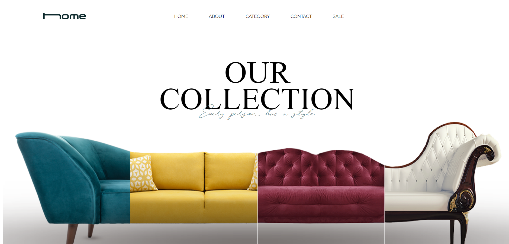
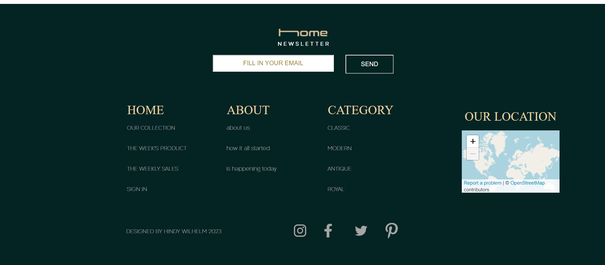

# Home Design Store Frontend

This repository contains a client-side web application for a home design store. It is developed using HTML and CSS, providing a straightforward browsing experience for home design products.

### Getting Started

1. Clone the repository:

   ```bash
   git clone https://github.com/saraweig/HomeDesignFrontend.git

2. Navigate to the project folder:

   ```bash
   HomeDesignFrontend

3. Open `index.html` in a web browser
   
### Usage
Simply navigate through the pages to browse and select products.<br>

### Screenshots
Home Page:
<br>
Site Map:


### Contributing
Contributions are welcome! To contribute:<br>
1. Fork the repository.<br>
2. Create a new branch (git checkout -b feature-branch). <br>
3. Make your changes.<br>
4. Commit your changes (git commit -m 'Add new feature').<br>
5. Push to the branch (git push origin feature-branch).<br>
6. Create a new Pull Request.

### License
This project is licensed under the MIT License.

### Contact
For any questions or feedback, feel free to contact me at sw6772154@gmail.com.
